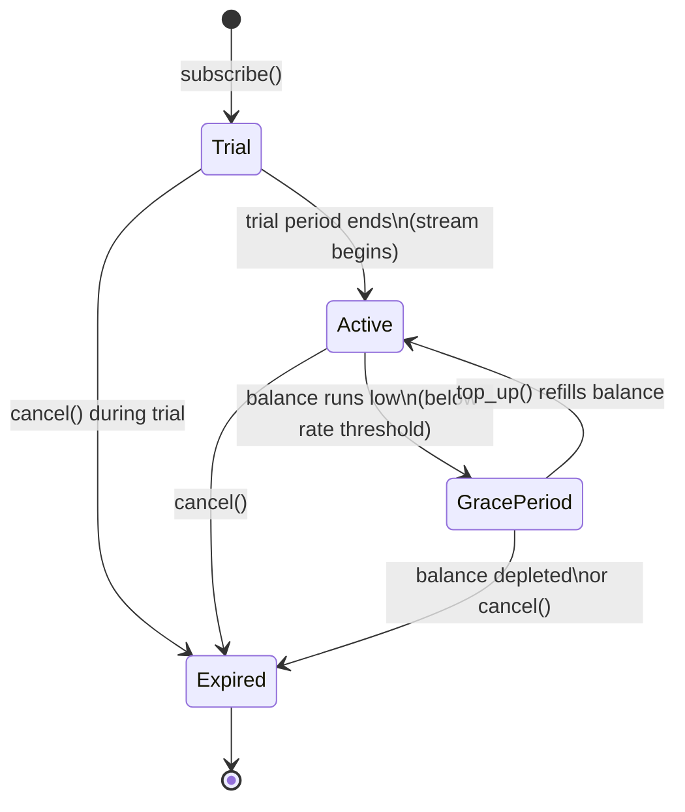

# SubStream Protocol: Decentralized Creator Economy

## Overview
SubStream is a **Pay-As-You-Go subscription protocol**. 
Instead of monthly credit card charges, fans stream tokens to creators second-by-second. 
If the fan dislikes the content, they can cancel instantly and get their remaining balance back.

## Key Logic
- **subscribe**: User deposits a buffer (e.g., 50 XLM) and sets a rate.
- **collect**: Creator triggers the withdrawal of accumulated seconds.
- **cancel**: Subscriber stops the stream and refunds unspent tokens.

## Network
- **Stellar Testnet**

## Deployed Contract
- **Network:** Stellar Testnet
- **Contract ID:** CAOUX2FZ65IDC4F2X7LJJ2SVF23A35CCTZB7KVVN475JCLKTTU4CEY6L

## Subscription State Flow



## Running Tests
To run the contract tests locally:
```bash
cargo test
```

## Building
To build the contract for Wasm:
```bash
cargo build --target wasm32-unknown-unknown --release
```

